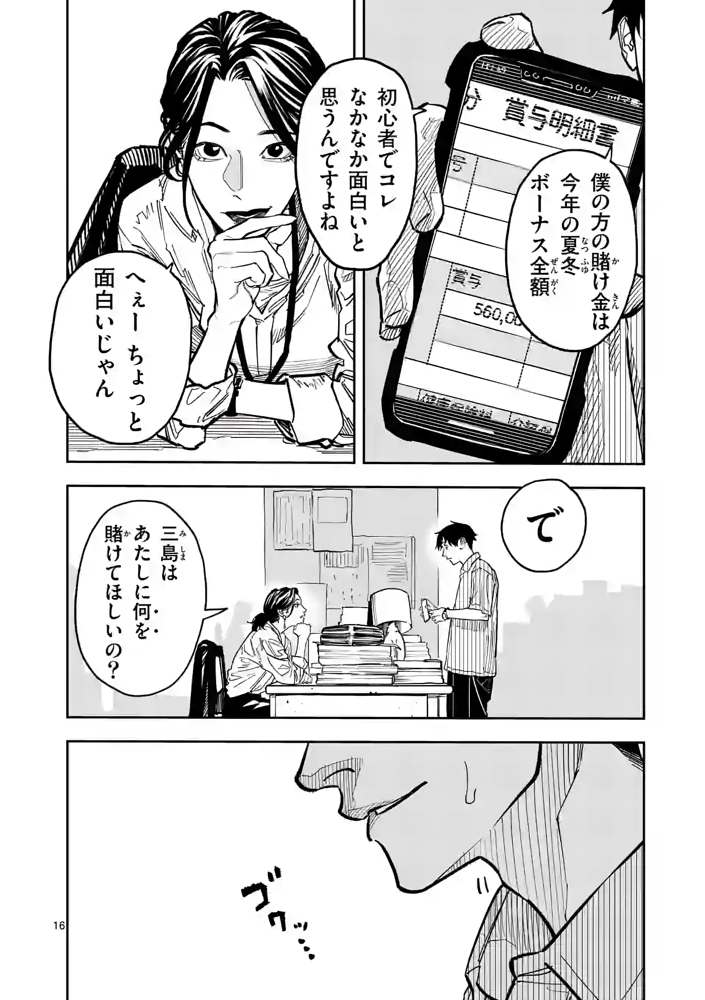
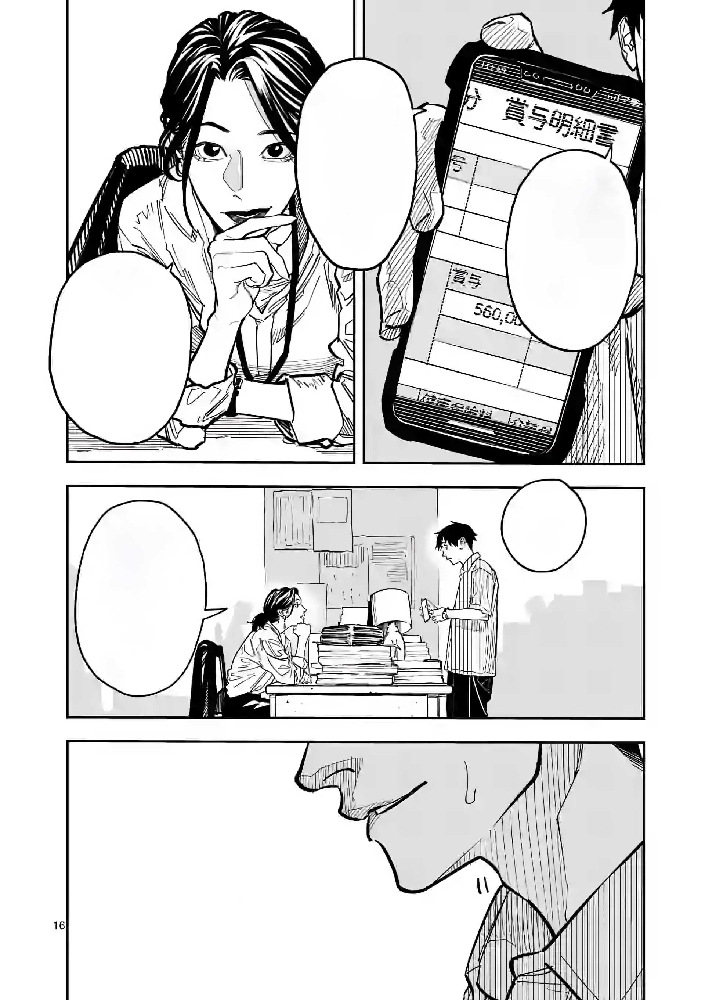

<table>
  <tr>
    <td><b>Before</b></td>
    <td><b>After</b></td>
  </tr>
  <tr>
    <td></td>
    <td></td>
  </tr>
</table>

---

### 🛠 Tools Used:
**Adobe Photoshop** – Pen Tool, Clone Stamp, Healing Brush, Content-Aware Fill, Custom Brushes, and more.

---

### ✨ Highlight:
**Entire facial area redrawn by hand using only a mouse and Photoshop tools.**  
Every line and tone was manually refined with patience and love for the craft.

Reference used:  

> 📎 PSD file also included in the repo  
> 🔍 Zoom in to explore the finer pixel work

---

### 💬 Love this? Hire me!
I'm deeply passionate about manga and anime art production.  
This is more than a hobby — it's my dream career.  
Let me bring your visuals to life with dedication and creative care.

*(日本語で)* あなたのアニメ業界の「ダーリン」になれるかも？💫  
(Ref: *Darling in the Franxx*)

---
