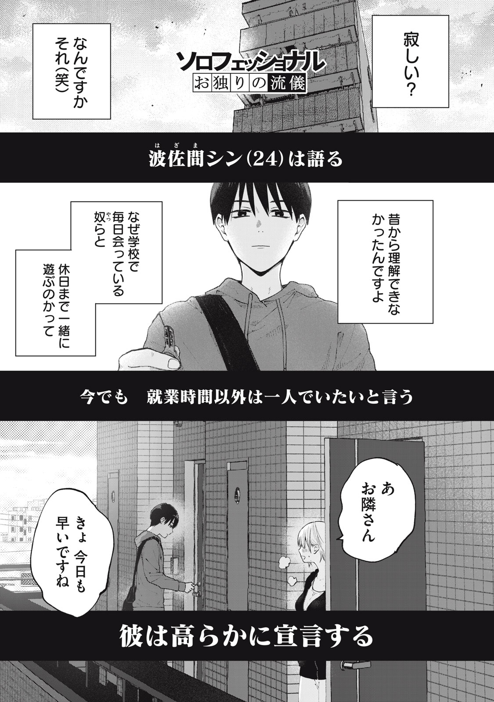
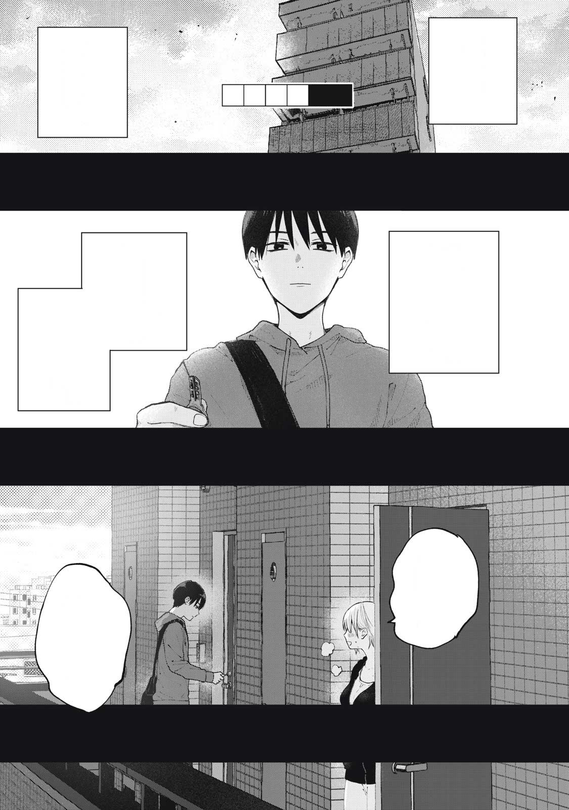

<table>
  <tr>
    <td><b>Before</b></td>
    <td><b>After</b></td>
  </tr>
  <tr>
    <td></td>
    <td></td>
</td>
  </tr>
</table>

---

Tools used: **Adobe Photoshop** (Pen Tool, Clone Stamp, Healing Brush, Content Aware Fill, Brushes...)

### ✨ Highlight:
**The array of words in japanese was moved to a seperate layer to draw entire building properly**  

---

> *Feel free to zoom in for better details.*

> Photoshop file also attached in this repo 