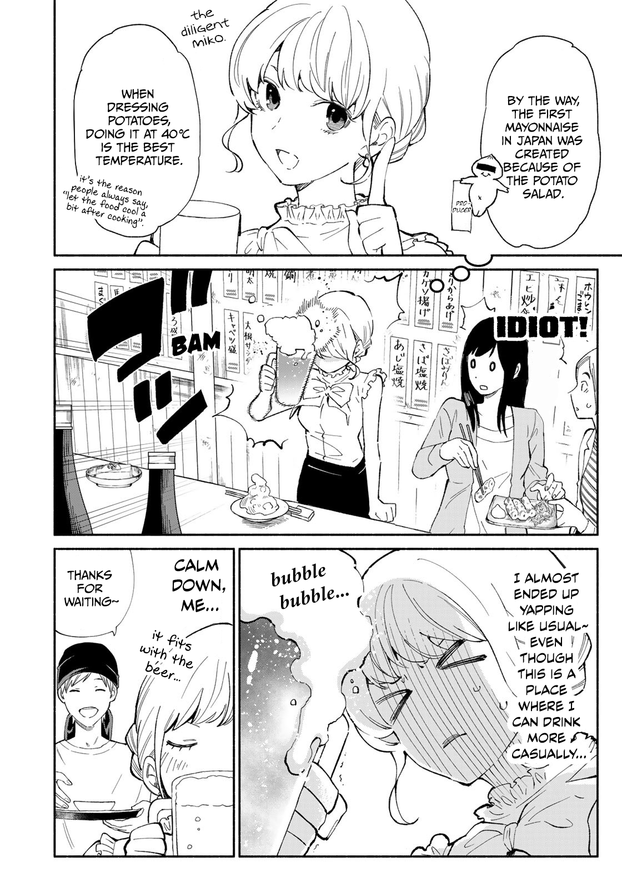
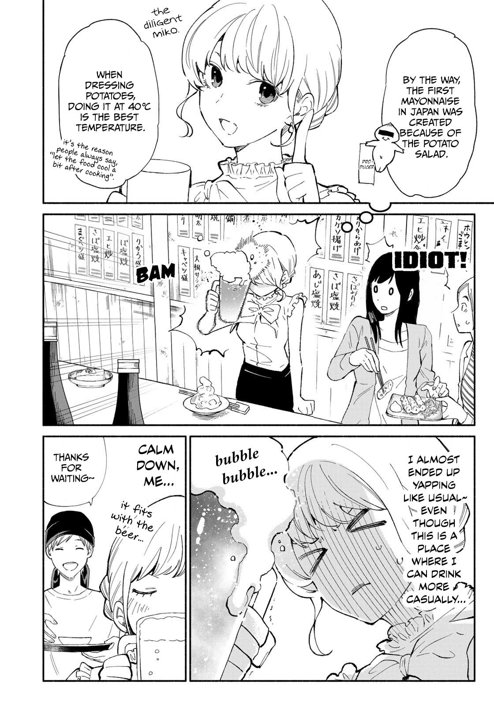

<table>
  <tr>
    <td><b>Before</b></td>
    <td><b>After</b></td>
  </tr>
  <tr>
    <td></td>
    <td></td>
</td>
  </tr>
</table>

---

Tools used: **Adobe Photoshop** (Pen Tool, Clone Stamp, Healing Brush, Content Aware Fill, Brushes...)

### Main focus

Removal of Japanese SFX and redrawing. I noticed the actual art had a misaligned poster so I removed that and redrew the whole. Sometimes I notice this thing, not sure if artist skipped the section.

---

> *Feel free to zoom in for better details.*

> Photoshop file also attached in this repo 